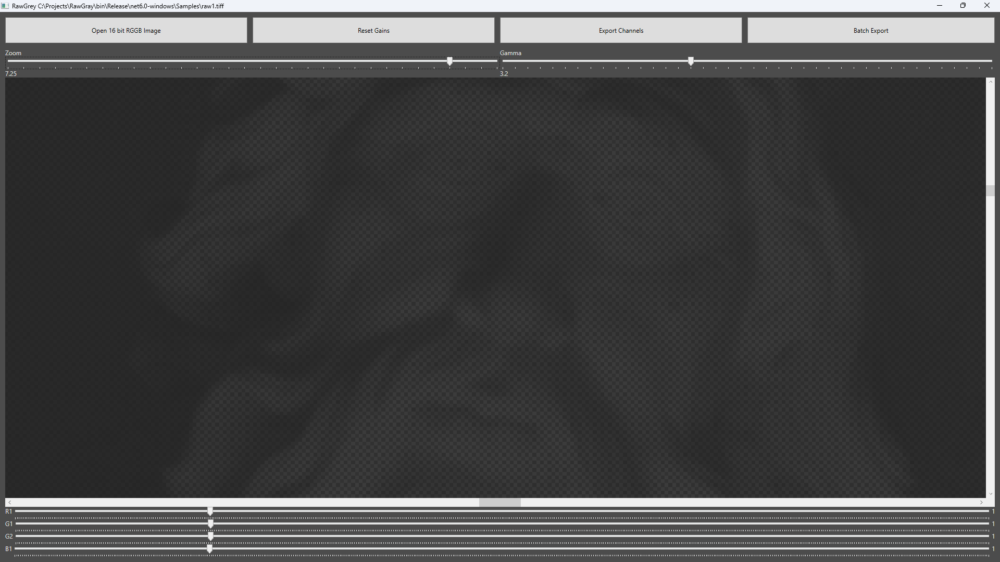

# RawGray

Extract Bayer channels from RAW images

# How to use it

- Convert RAW images to 16 bit TIFF with [RawTherapee](https://www.rawtherapee.com) by setting the Demosaicing Method "None"
- Open the TIFF image with RawGray
- By using the R,G1,G2,B sliders, balance as desired
- Export Channels to write 4 images, one for each channel

# Notes

- RAW images are supposed to have the bayer pattern RGGB (ex. Sony Alpha Camera). Different patterns require code changes or just rename the exported files (ex. for BGGR swap R and B channels).
- There are some TIFF sample images bundled with the software. Try them to on-board quickly.

# Requirements

[.NET 6.0 Desktop Runtime](https://dotnet.microsoft.com/en-us/download/dotnet/6.0)